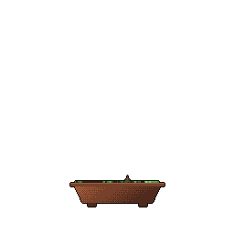

<!-- Header animado -->

  

  
  

---

### 🧑‍💻 Sobre mim

- 🎓 Cursando **Análise e Desenvolvimento de Sistemas** no **Instituto J&F** (2/3)
- ⚙️ Foco em **back-end** e **engenharia/análise de dados**
- 🧱 Gosto de soluções eficientes, limpas e bem estruturadas
- 🌱 Aprendendo agora:
  - ☕ **Java** — boas práticas e design patterns
  - 📊 **SQL** — modelagem e otimização de consultas
  - 🍃 **NoSQL** — MongoDB
- 💬 Pode me chamar para trocar ideia sobre código, dados ou café

 

---

### 🛠️ Stack

  <b>Linguagens</b>  
  

  <b>Bancos de dados</b>  
  
  

  <b>Dados & Ferramentas</b>  
  
  
  

---

### 📈 Estatísticas

  

  
  

  
  

  

---

### 🧊 [A] Contribuições em 3D

  <picture>
    <source media="(prefers-color-scheme: dark)" srcset="https://raw.githubusercontent.com/dvarakaki/dvarakaki/main/profile-3d-contrib/profile-night-rainbow.svg" />
    
  </picture>

### 👾 [B] Pac-Man

  <picture>
    <source media="(prefers-color-scheme: dark)" srcset="https://raw.githubusercontent.com/dvarakaki/dvarakaki/extras/pacman-contribution-graph-dark.svg" />
    
  </picture>

### 🧱 [C] Breakout

  <picture>
    <source media="(prefers-color-scheme: dark)" srcset="https://raw.githubusercontent.com/dvarakaki/dvarakaki/extras/breakout-contribution-graph-dark.svg" />
    
  </picture>

### 🐍 [D] Snake com IA (cresce ao comer)

### 🌌 [E] Contribuições com gravidade

### 🐱 [F] Gatinho que reage à sua atividade

  <picture>
    <source media="(prefers-color-scheme: dark)" srcset="https://raw.githubusercontent.com/dvarakaki/dvarakaki/main/dist/pet.svg" />
    <source media="(prefers-color-scheme: light)" srcset="https://raw.githubusercontent.com/dvarakaki/dvarakaki/main/dist/pet-light.svg" />
    
  </picture>

### 🏙️ [G] Cidade isométrica do gatinho

### 🌳 [H] Bonsai que cresce com commits

### ⚡ [I] Atividade recente

<!--START_SECTION:activity-->
1. 🎉 Merged PR [#16](https://github.com/InventraTech/inventra-data-modeling-2/pull/16) in [InventraTech/inventra-data-modeling-2](https://github.com/InventraTech/inventra-data-modeling-2)
2. 💪 Opened PR [#16](https://github.com/InventraTech/inventra-data-modeling-2/pull/16) in [InventraTech/inventra-data-modeling-2](https://github.com/InventraTech/inventra-data-modeling-2)
3. 🗣 Commented on [#15](https://github.com/InventraTech/inventra-data-modeling-2/pull/15#issuecomment-5728934207) in [InventraTech/inventra-data-modeling-2](https://github.com/InventraTech/inventra-data-modeling-2)
4. 🎉 Merged PR [#14](https://github.com/InventraTech/inventra-development-spring-redis-neo4j-2/pull/14) in [InventraTech/inventra-development-spring-redis-neo4j-2](https://github.com/InventraTech/inventra-development-spring-redis-neo4j-2)
5. 💪 Opened PR [#14](https://github.com/InventraTech/inventra-development-spring-redis-neo4j-2/pull/14) in [InventraTech/inventra-development-spring-redis-neo4j-2](https://github.com/InventraTech/inventra-development-spring-redis-neo4j-2)
<!--END_SECTION:activity-->

---

### 📊 [K] Metrics completo (lowlighter)

### 💻 [M] Estatísticas estilo terminal

  

### 🃏 [N] GitCard Studio

  
  
  
  

### 👀 [O] gitglance

### 📈 [P] ghstats.dev

### 🖼️ [Q] Retrato pixelado (sua foto do GitHub)

  <picture>
    <source media="(prefers-color-scheme: dark)" srcset="https://raw.githubusercontent.com/dvarakaki/dvarakaki/main/portrait-dark.svg" />
    
  </picture>

### ♒ [R] Cartão de signo

### 📅 [S] Mensagem do dia

  
  

### 💬 [T] Frase de programação

### 😂 [U] Piada de dev

### 🐍 [J] Cobrinha clássica

  <picture>
    <source media="(prefers-color-scheme: dark)" srcset="https://raw.githubusercontent.com/dvarakaki/dvarakaki/output/github-contribution-grid-snake-dark.svg" />
    
  </picture>

---

  <i>"A melhor maneira de prever o futuro é criá-lo." — Alan Kay</i>  
  ⭐ Obrigado pela visita! Volte sempre. 😄

